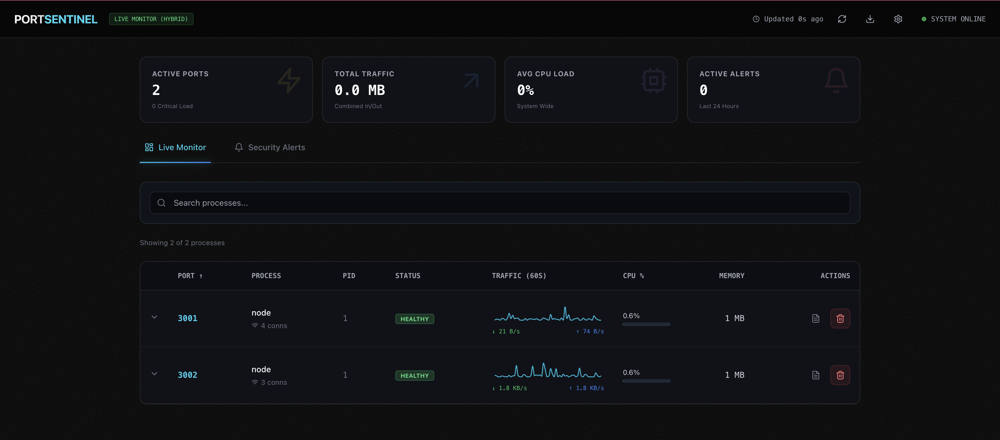

# PortSentinel (Linux Beta) 🛡️

[](https://github.com/dev-sweeton/port-sentinel)
[](https://hub.docker.com/)

**PortSentinel** is the ultimate localhost process manager. It gives you a "God Mode" dashboard to monitor, manage, and kill processes running on your server.

> **⚠️ BETA NOTICE**: This release is fully functional on **Linux** and **Windows (WSL)**. Support for **macOS Terminal** is currently **under development**.



## 🚀 Quick Start (Docker)

Run PortSentinel with a single command (similar to Dozzle/Portainer).

```bash
docker run -d \
  --name portsentinel \
  --restart unless-stopped \
  --pid host \
  --network host \
  --privileged \
  -v /var/run/docker.sock:/var/run/docker.sock \
  sweetnotfound/portsentinel:v1.0.0-beta
```

**That's it!** Access your dashboard at:
> **http://localhost:3001**

**Note**: The default port is **3001**. To change it, add `-e PORT=XXXX` to your docker command.

### 🐳 Docker Compose

If you prefer `docker-compose.yml`:

```yaml
version: '3.8'
services:
  portsentinel:
    image: portsentinel:latest
    container_name: portsentinel
    restart: always
    # Critical for monitoring the host system
    pid: host
    network_mode: host
    privileged: true
    volumes:
      - /var/run/docker.sock:/var/run/docker.sock
```

### 🪟 Windows (WSL 2)

If you are using **WSL 2** (Ubuntu/Debian on Windows), PortSentinel works perfectly!

Run the **exact same Linux command** above inside your WSL terminal.
*   It will monitor all processes running inside your WSL instance.
*   **Note**: To access the dashboard, you can still use `http://localhost:3001` from your Windows browser.

---

## ✨ Features

- **🔥 Process Control**: View specific details, kill processes, or bulk-terminate memory hogs.
- **🛡️ Security Audit**: Instantly spot processes listening on public interfaces (`0.0.0.0`) vs localhost.
- **⚡ Real-Time**: Live updates (1s interval) of CPU, Memory, and Network usage.
- **🧹 Auto-Cleanup**: Prevents accidental killing of system-critical PIDs (0, 1).
- **📋 Log Viewer**: Watch live logs/output stream for any running process (Beta).

---

## 🛠️ Building from Source

If you want to build the image yourself:

1. **Clone the repo**
   ```bash
   git clone https://github.com/dev-sweeton/port-sentinel.git
   cd port-sentinel
   ```

2. **Build the Image**
   ```bash
   docker build -t portsentinel:latest .
   ```

3. **Run**
   ```bash
   docker-compose up -d
   ```

---

## 🤝 Contributing

If you encounter any issues or have questions, please [create an issue in the repository](https://github.com/dev-sweeton/port-sentinel/issues).

1. Fork the repo
2. Create your feature branch (`git checkout -b feature/cool-new-thing`)
3. Commit your changes
4. Push to the branch
5. Open a Pull Request

---

## ☕ Support

If PortSentinel saved your server from a rogue process, consider buying a coffee!

<a href="https://buymeacoffee.com/sweeton" target="_blank"></a>
